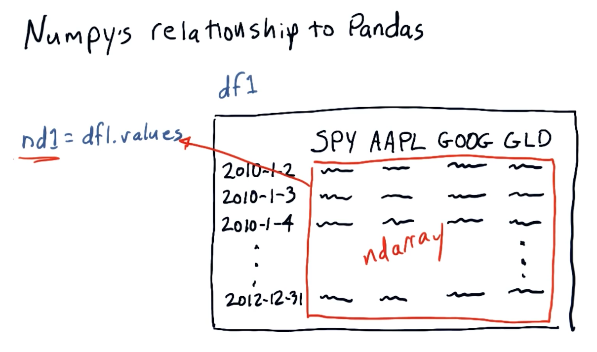

# 1-3: The power of NumPy

## NumPy's relationship to Pandas

`pandas` is essentially a wrapper for `numpy` `ndarray` objects. Below is a
screenshot from the lectures providing a conceptual overview of the objects'
relationships:

