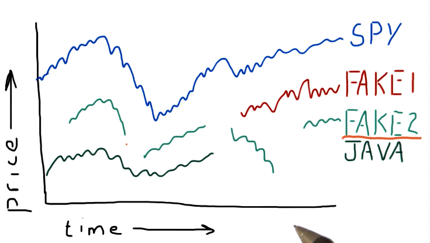

# 1-5: Incomplete data

While we might think financial data is well documented, sometimes financial
data that we want to inspect can be missing from public archives. This lesson
covers how we can mitigate the consequences of missing financial data.

## Pristine data

Below is a screenshot from the lecture listing some of the issues with
incomplete financial data:

## Why data goes missing

From the lecture, some examples are given as to why stocks disappear or appear
in the data / timeline. Some stocks get acquired by different companies, so
companies completely go under and are no longer traded, and some stocks appear
in the middle of the timeline because they are newer. A high-level representation
from the lecture is provided below:

## What can we do?

Pandas provides us with the ability to **fill forward** and **fill backwards** 
missing data between two points in time with the last known-good data point.
It's best practice to **fill forward** first and then **fill backwards**. A
high-level representation of this concept is from the lecture is provided below:

