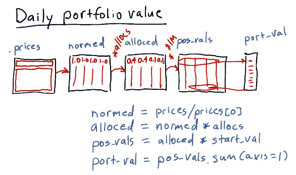
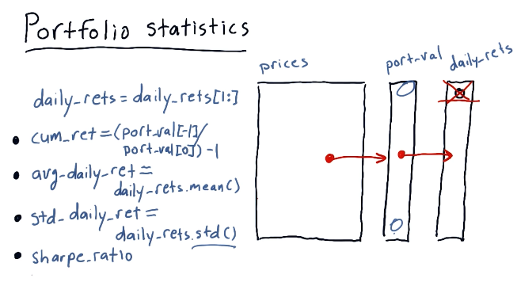
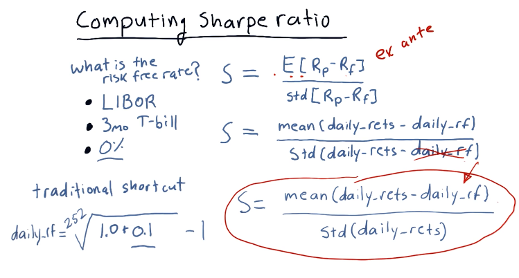
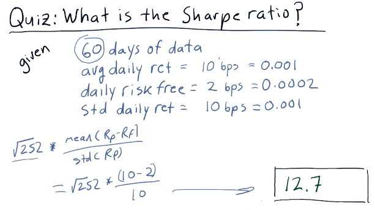

# 1-7: Sharpe ratio and other portfolio statistics

In this lesson we cover portfolio statistics used in the real world and how to
calculate and interpret these statistics using Python.

## Daily portfolio values

Given a starting investment amount, allocation percentages to respective stocks,
and a window in time to conduct calculations, we can calculate the daily value
of a portfolio over a given period of time.

Taking the `prices` dataframe, we can normalize the data and apply a series of
transforms to arrive at an array of values describing our portfolio's daily
value over a given period of time. Below is a high-level interpretation of how
to achieve this outcome given a dataframe:

## Portfolio statistics

Using our new portfolio value array, we can calculate a series of important
statistics, such as:

* cumulative return
* average daily return
* standard daily return
* sharpe ratio

A high-level interpretation from the lecture is provided below. This image also
provides the equations to derive the statistics listed above:

## Sharpe ratio

The **sharpe ratio** of a portfolio is a statistic that adjusts overall return
for risk apparent in the portfolio. This is mostly useful when comparing two
stocks or portfolio wherein one has a greater return but poses a greater risk -
it allows us to make an informed decision about the riskier of the two stocks.

A high-level representation of these concepts from the lectures is provided
below:

## Computing sharpe ratio

To compute the **sharpe ratio** we need to divide the Expected Value of the
portfolio returns minus the risk free rate by the standard deviation of the
portfolio returns minus the risk free rate. The slide from the lectures, below,
provides possible references for the risk free rate, however, traditionally it's
been `0`.

## Sharpe ratio frequency

The **sharpe ratio** can be affected by the frequency in which sampling of the
portfolio occurs - it was originally intended to be an annual measure. In order
to acquire the annualized version of the **sharpe ratio**, you multiply the
**sharpe ratio** result by the constant `k`. This is calculated by taking the
square root of the frequency of sampling. The slide from the lecture provides
more insight into how the **sharpe ratio** is affected by frequency:

## Quizzes

### What is the sharpe ratio?

Below is a quiz from the class providing us with a scenario to calculate the
sharp ratio with concrete values:

