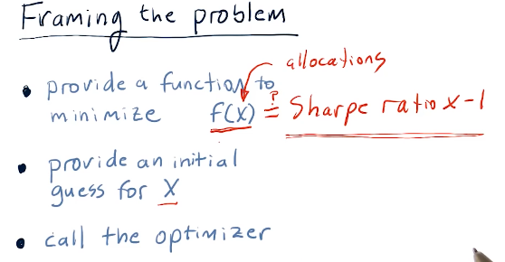

# 1-9: How to optimize a portfolio

### What is portfolio optimization?

Given a set of assets and a time period, find an allocation of funds to assets
that maximizes performance.

### What is performance?

We can choose from a number of statistics such as:

* Cumulative returns
* Volatility or risk
* Risk adjusted returns (Sharpe ratio)

## Framing the problem

So how do we go about optimizing a portfolio? We use an optimizer to find the
inverse Sharpe ratio for a given set of allocations in a portfolio. A high-level
representation provided by the lecture is provided below:

## Ranges and constraints

**Ranges and constraints** on the values of X provided to the optimizer for the
function to be minimized can help speed-up the rate at which the optimize can
solve the minimization of the function. **Ranges** in this case should be
limited from `0` to `1` as these represent percentages. **Constraints** in this
example specify that the `sum(x)` should equal `100` - meaning our allocations
reach 100% for an effectively optimized portfolio. Below is the slide from the
lecture discussing this topic:

