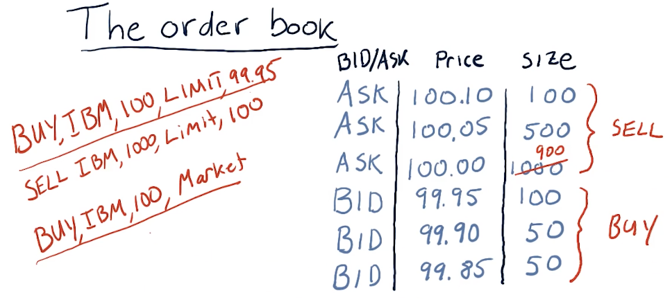
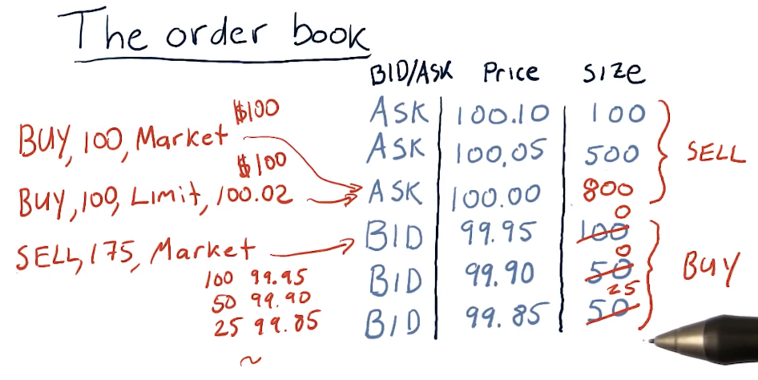
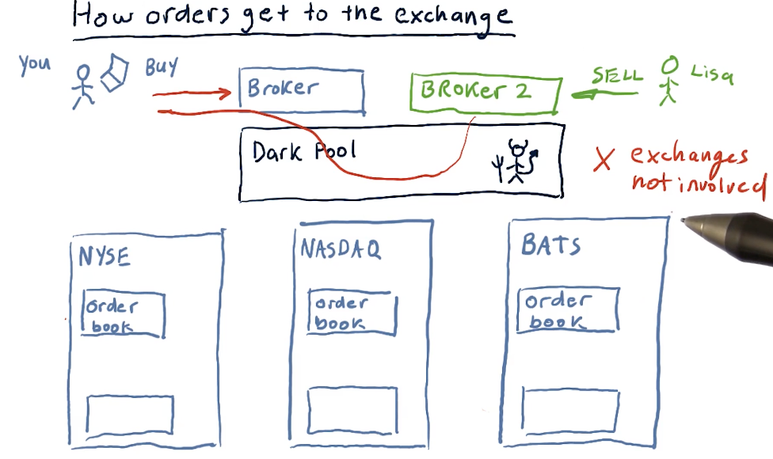
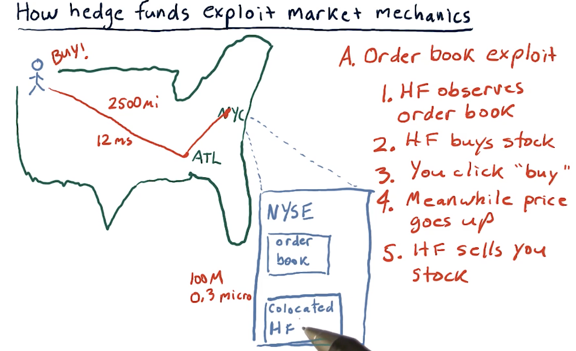
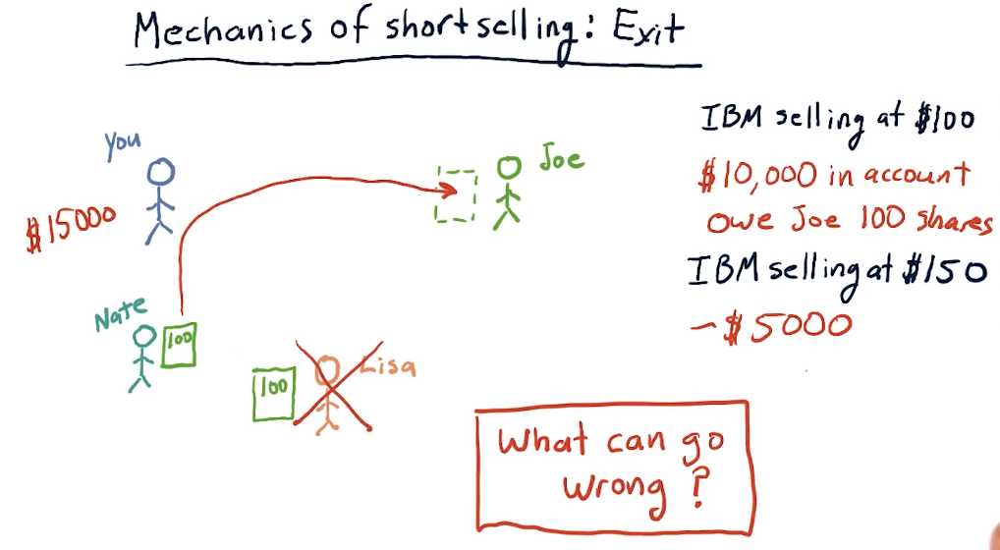

# 2-2: Market mechanics

This lesson covers some fundamentals of how orders are handled on the market.

## What is an order?

Usually orders are sent to a stock broker and are executed on your behalf. Below
is all the information that must go into a well-formed order:

* Buy or sell
* Symbol
* Number of shares
* Limit or Market
  * Market specifies that you're ok with buying or selling at the current
market's price.
  * A limit specifies that you're asking for a specific price.
* Price

## The order book

Below is a high-level overview of what a market's order book could look like
during a trading day - provided by the lecture.

## How orders affect the order book

The lecture provides a high-level overview of how the order book is affected
by buy and sell orders in the market. In this example, all buy and sell orders
are **market** orders.

## How orders get to the exchange

The lecture provides a high-level overview of how orders reach the exchange
after being received by the brokers. The image below describes the existence of
dark pools - I'm not sure how these are legal.

## How hedge funds exploit market mechanics

Hedge funds have the ability to be co-located with the exchanges, so they can
see trends in stocks faster than those who are trading remotely via brokers.
Using this, they exploit the time different to buy and sell stocks at a profit.
They also conduct this exploit across continents with different exchanges. A
high-level overview from the lectures is provided below:

## Additional order types

* Stop loss - sell the stock when it loses a certain amount of value
* Stop gain - sell the stock when it gains a certain amount of value
* Trailing stop
* Sell short - take a negative position against a stock

## Short selling

Short selling is a strategy where we borrow stocks from someone, sell those
stocks to someone looking to buy, and then when the person we borrowed from
wants their stock back, we buy the stock and give the stock back as promised.
What we're hoping for is that the stock **decreases** in value, allowing us to
buy the stock at a lower price, netting us a profit.

### What can go wrong?

In short selling, we can have an **unlimited** amount of losses. If the stock
increases, we sell back at a loss, and we **must** give back the stock when the
person we borrowed from wants their stock back.

