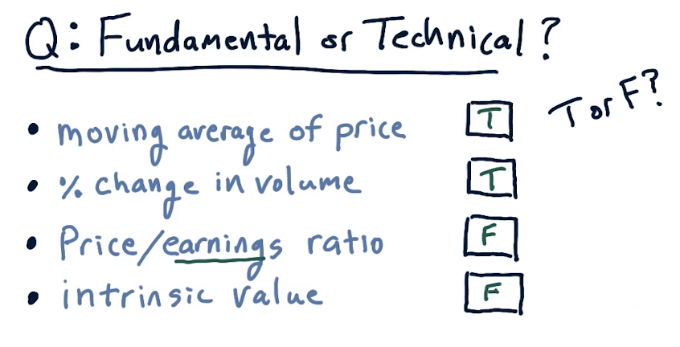
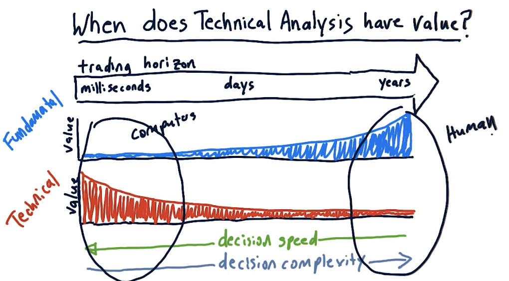
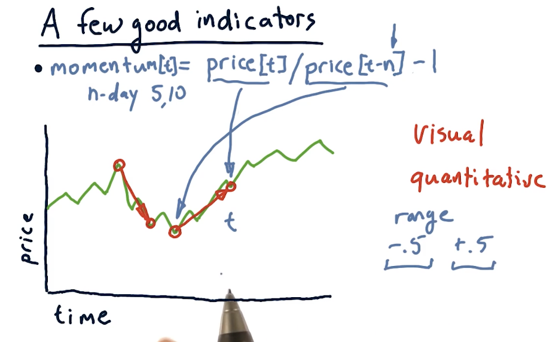
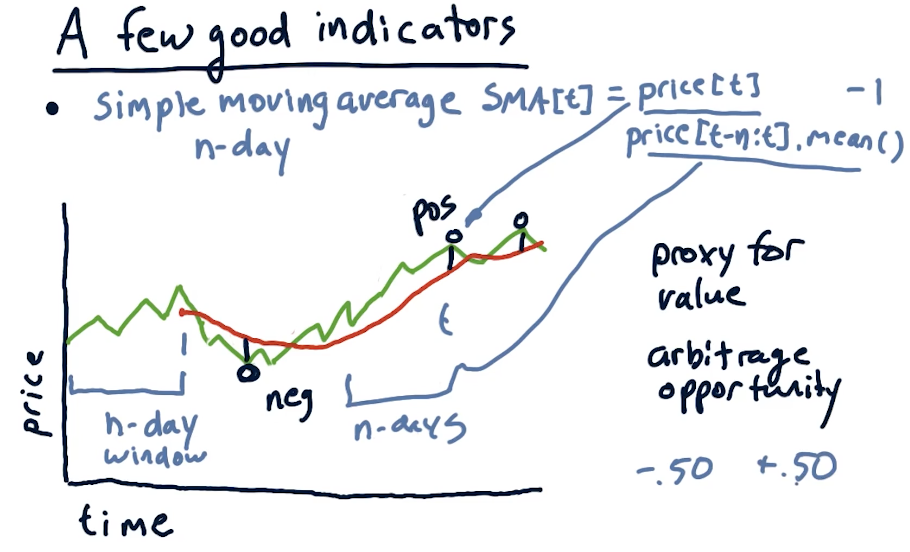
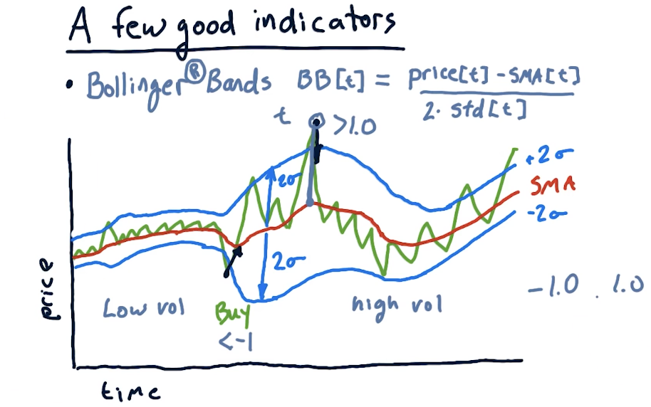

# 2-6: Technical analysis

There are two broad ways to choose stocks to buy or sell:

* **fundamental analysis** - looking at aspects of a company to estimate its
value, looking to see if the price of a company is below its value
* **technical analysis** - looking for patterns or trends in a stock's price

## Characteristics

The following are some characteristics of technical analysis:

* historical **price** and **volume**
* computing statistics called **indicators**
* leveraging **indicators** as **heuristics**

Why might these techniques work for technical analysis? Well, there is
information to be found in the price of a stock, and heuristics work and have
plenty of uses for artificial intelligence.

## Fundamental or technical?

The following slide displays some technical and fundamental indicators:

## When is technical analysis effective?

The lecture provides circumstances in which technical analysis is effective:

The lecture also provides a high-level breakdown of when technical analysis
excels versus fundamental analysis. As we can see in the graph below, humans are
best at technical analysis for long-term trading horizons, and computers are
best at technical analysis in the short-term.

## Good indicators

### Momentum

Over **X** number of days, how has the price changed? It can be calculated as
such:

* `momentum[t] = (price[t] / price[t-n]) - 1`

### Simple moving average

Given an **N** day window, we calculate the average price of the stock over
multiple windows. This essentially smooths out the graph of the stock. Some
important events when using simple moving average are:

* The current price crosses above the simple moving average. Combined with
momentum, this can by a **buy** signal.
* Proxy for real value. If we see diversions away from the simple moving
average, we should expect to see the price return to the simple moving average.
This can be used as an arbitrage opportunity.

Using simple moving average, we can also calculate point values using the
following equation:

* `sma[t] = (price[t] / price[t-n:t].mean()) - 1`

## Bollinger bands

We've talked about **Bollinger bands** previously - these use standard deviation
on the simple moving average to measure deviation for indicators. The equation
to calculate a **Bollinger band** for a day is:

* `bb[t] = (price[t] - sma[t]) / (2 * std[t])`

## Normalization

Plugging these indicators into a machine learning algorithm, it's quite possible
that some indicators could become more influential than others. With that, we
leverage normalization to provide our machine learning algorithm with indicators
that maintain their original information, however, are not weighted due to their
value. The equation for normalization is:

* `(values - mean) / values.std()`