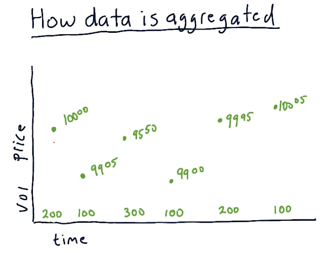
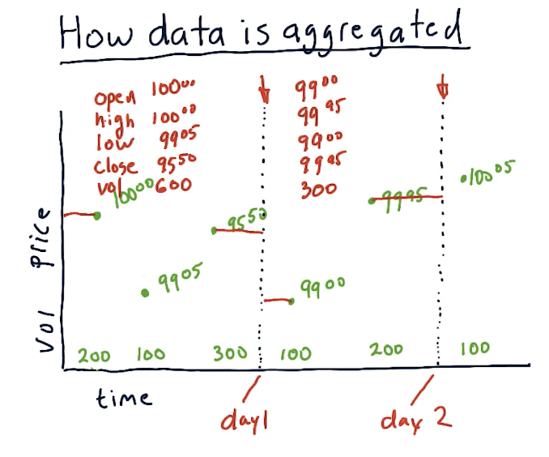
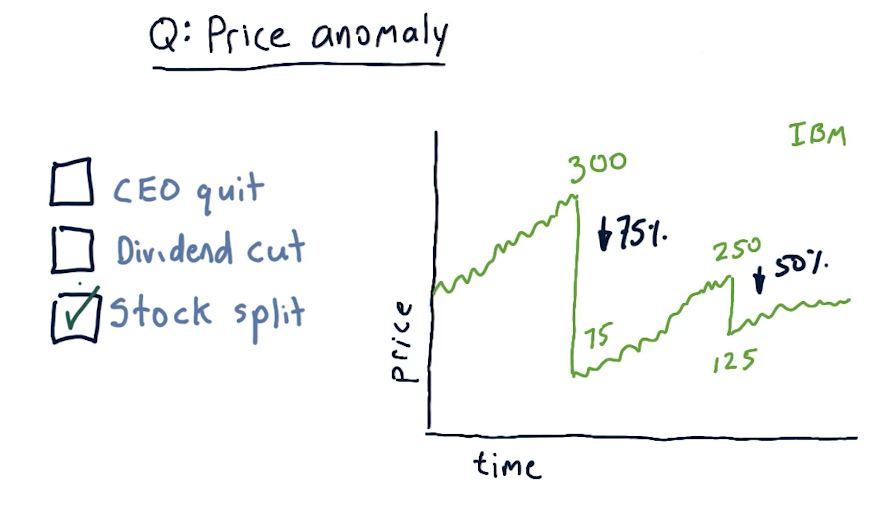
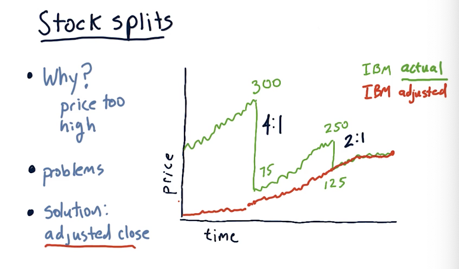
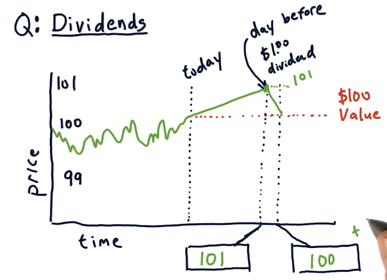
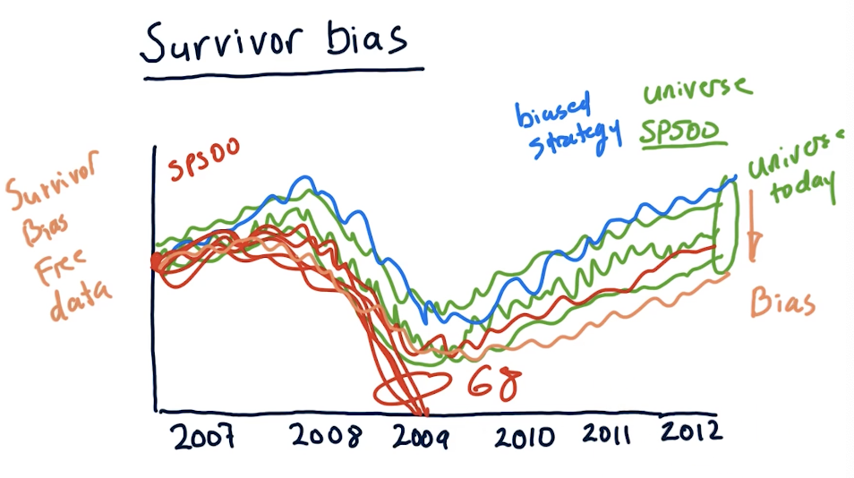

# 2-7: Dealing with data

Data is obviously important for computational investing. The core data that we
work with in this course is historical price and volume data.

## How data is aggregated

The unit of measurement for transactions is called a **tick**. These **ticks**
happen at no particular time, and they can be happening across multiple
exchanges. For each **tick**, we track the **price** and **volume** of the
transaction across time. A high-level representation from the lectures is below:

A lot of transactions occur during a trading day, and tracking every single
**tick** requires a lot of computing and a lot of space to store the data.
We can aggregate the data by only tracking the price of a specific stock during
certain **time slices**. For this class, we'll be tracking specific metrics by
**day**, however, with more computing you could feasibly track metrics with
smaller time slices. Per time slice, we track the following metrics:

* **open** - the first price on the first trade
* **high** - the highest trade price during the time slice
* **low** - the lowest trade price during the time slice
* **close** - the last trade price during the time slice
* **volume** - how much of the stock was traded during the time slice

A high-level overview from the lectures is provided below:

## Price anomaly

A large drop in the price of shares for a given stock is called a
**price anomaly**. A slide from the lectures is provided below. In this case,
the stock experienced a **stock split**, cause the price to drop tremendously.

## Stock splits

Why do stocks split? The most common reason is because **the price is too high**
. Why are high prices a problem? Highly priced stocks cause them to be less
liquid, making it harder to trade and buy options on the stock. High prices also
make it difficult to finely tune portfolios, especially if you want to have a
specific percentage of allocation for one security.

An issue with **stock splits** is that your machine learning model could mistake
this large drop in price as an opportunity to short the stock, however, this
stock isn't actually losing value - more shares are available. This is why
**adjusted close** was created, allowing us to adjust the **true** price of the
stock and avoid confusion due to **stock splits**. A slide from the lecture is
provided below:

## Dividends

Companies pay shareholders **dividends**, usually some percentage of the stock
price like %1. When conducting computational trading, we'll have to account for
this as the stock ticks up in price dependent upon the **dividend** expected to
be paid out. The usual trend for a stock is that the stock rises by the amount
of the **dividend** the **day before** it is processed. Immediately after that,
the stock price decreases back to its original value. A slide from the lectures
is below:

## Adjusting for dividends

Just like **stock splits**, we can account for **dividends** by using the
**adjusted close** price with the latest data from an exchange. A lecture from
the slides demonstrating this is provided below:

## Survivor bias

**Survivor bias** is a built-in bias that we can encounter when analyzing our
strategy over time using stocks that currently exist today. We assume that our
strategy works well, but we're using data in the future, not the past. If we
were to conduct the same strategy in the past, in this case in 2007, we can
see that **68 stocks** completely plummeted during the 2008 crash, leaving the
**SP500**. In this case, these stocks did not survive and our strategy
completely failed.

We can purchase **survivor bias free data** to conduct analysis of our strategy,
but this is something we should always keep in mind and avoid. A slide from the
lectures is provided below:

