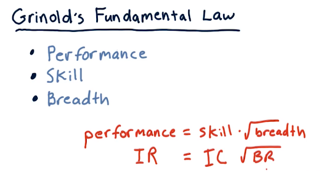
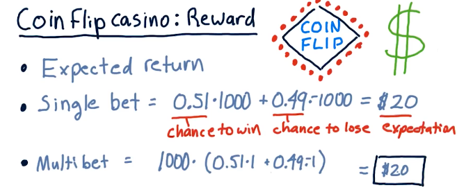
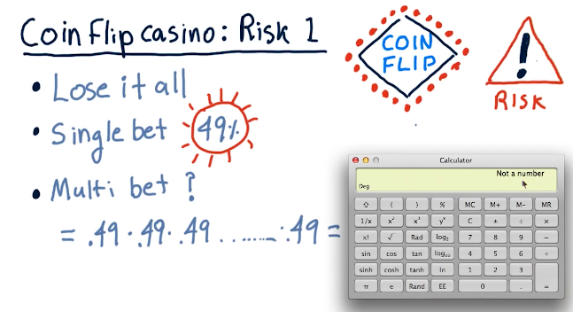
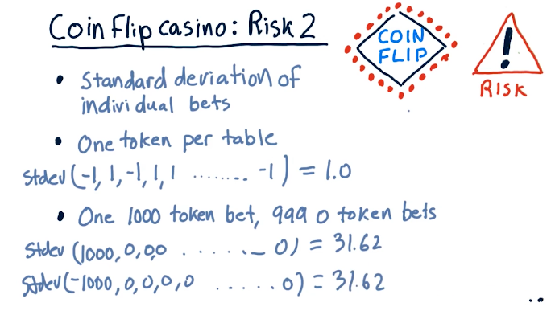
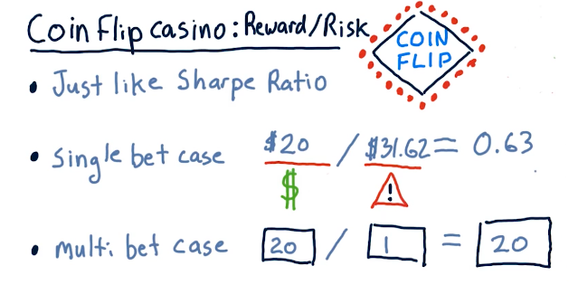
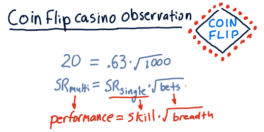
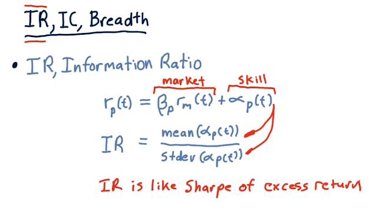

# 2-9: The fundamental law of active portfolio management

## Grinold's fundamental law

This fundamental law of **active portfolio management** describes
**performance** in the terms of **skill** and **breath**. These two factors
create a ratio wherein you can increase your performance as an active portfolio
manager by increasing your skill **or** you can increase the number of
opportunities to test your skill. A slide from the lectures is provided below:

## Coin flip casino

This lecture discusses some scenarios using a coin flip casino, where risk and
reward are compared for different betting strategies on the flip of a coin.
Fortunately for us, we know that the coin has a **0.51%** chance of landing on
heads.

The two betting options are:

1. Bet $1000 on one coin flip
2. Bet $1 on one-thousand coin flips

Obviously, betting $1 on one-thousand coin flips is the best option - this
lecture uses this teaching point to demonstrate calculating expected value,
probability, and risk via standard deviation.

### Expected value

### Probability

### Standard deviation

### Sharpe ratio

## Observations

Going back to **Grinold's fundamental law**, if we take the **sharpe ratio** of
the multi-bet and the single-bet and the number of bets, 1000, we encounter that
this follows **Grinold's fundamental law**. See below for evidence from the
lecture:

So the following are some good observations:

* Sharpe ratio grows as the square root of breadth increases.
* Sharpe ratio grows as **alpha** increases.

## Information ratio

**Information Ratio (IR)** is like the **sharpe ratio** for excess return,
**alpha**. The equation broken down is in the lecture slide below:

## Information coefficient and breadth

**Information coefficient (IC)** is the correlation of an active manager's
forecasts to returns. **Breadth (BR)** is the number of trading opportunities
per year.