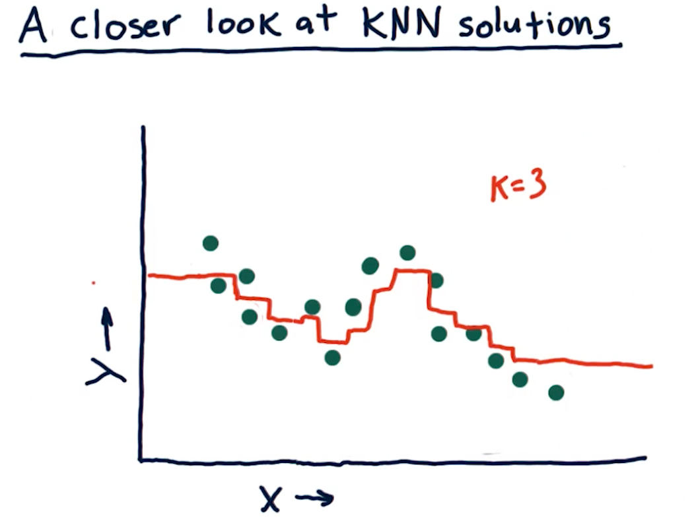
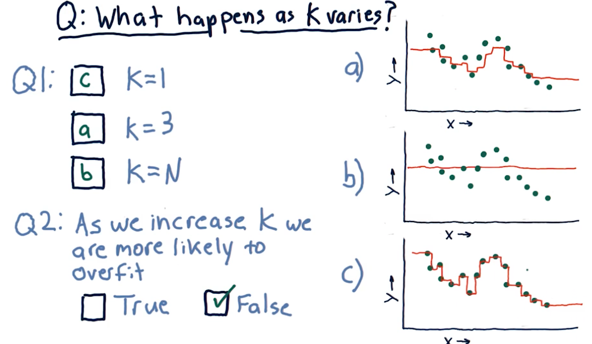
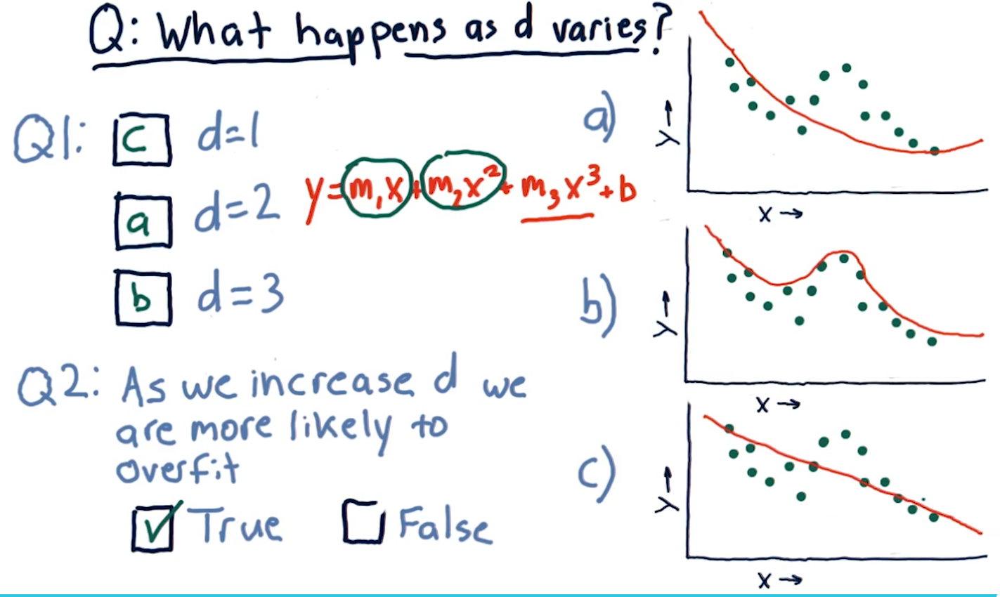
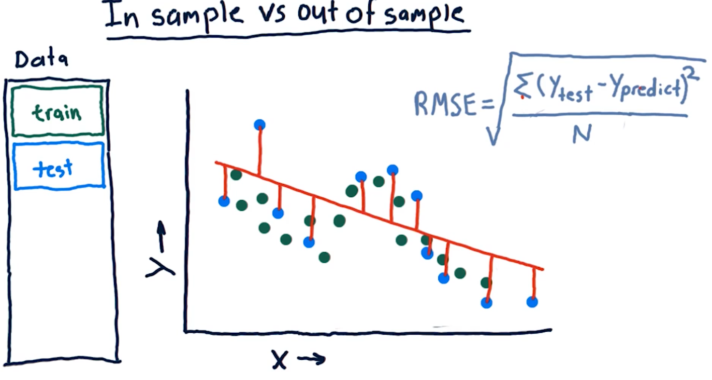
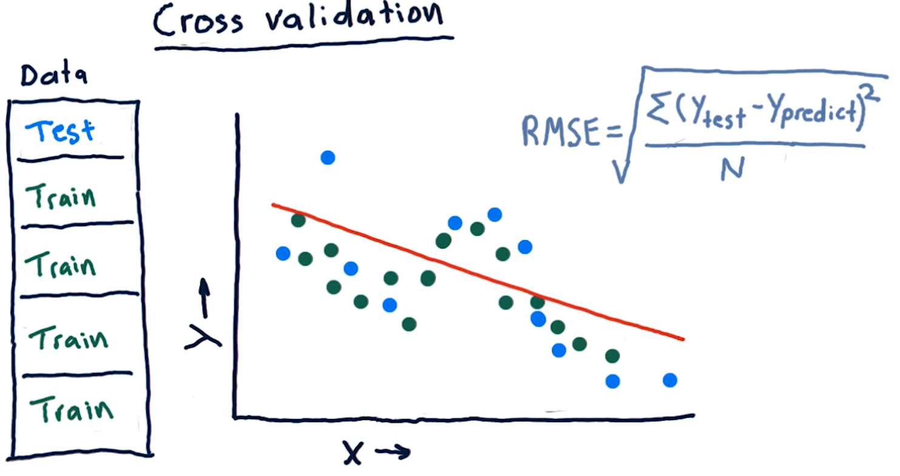
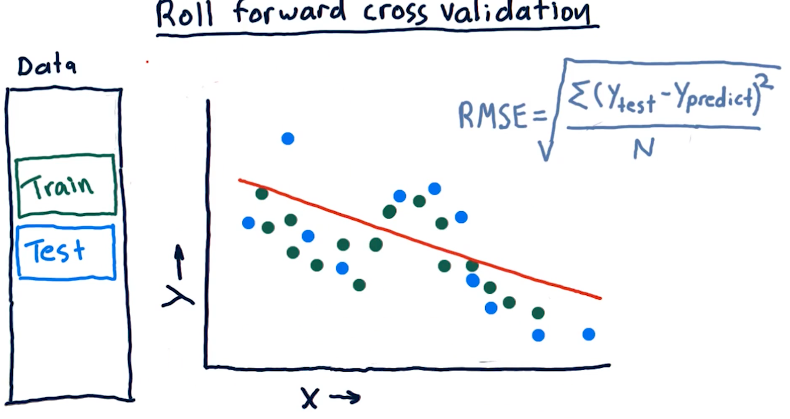
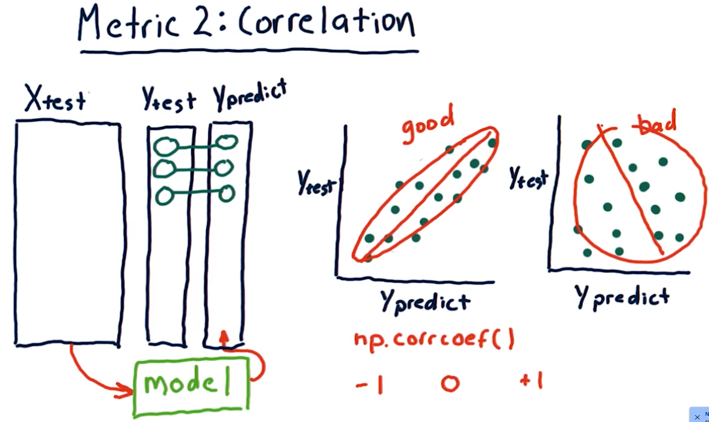
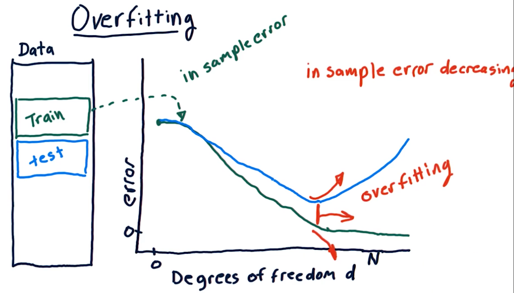
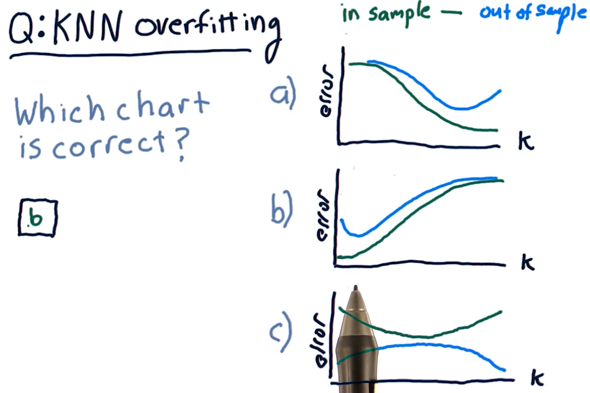
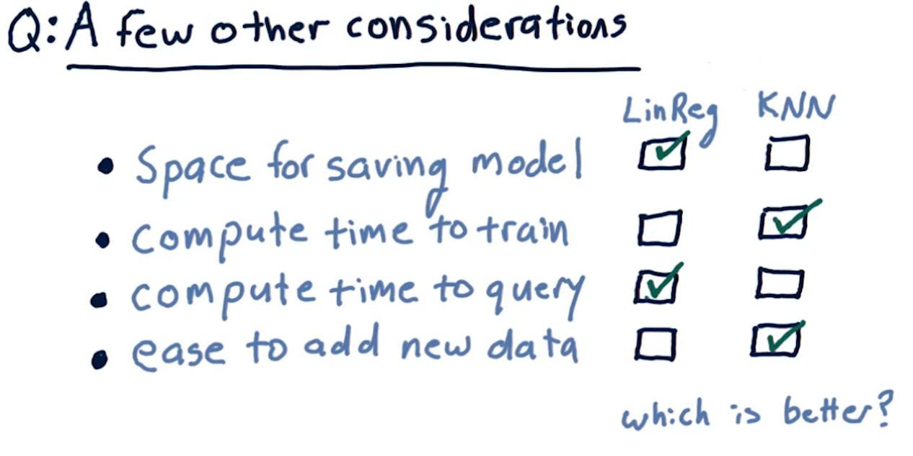

# 3-3: Assessing a learning algorithm

## A closer look at KNN solutions

This section of the lecture just reviews KKN solutions and how trend lines can
be generated from them by using the KNN algorithm. In the example from the
lectures below, we see that we're taking the **mean** value for **k** nodes at
some point `x, y` and drawing the entry at that location. The greatest drawback
of this method is that, on the edges, we receive straight lines because of the
back fill and forward fill of data:

## What happens as K varies?

When `k` approaches `N` number of entries, we see that the graph drawn provides
us less information - it essentially becomes a straight line for some sets of
data. In contrast, a `k` value of `1` provides us with a line that is basically
discrete. The final question this section in the lecture asks is:
"As we increase K we are more likely to overfit?". The answer is **false**,
as `k` increases the line drawn fits less of the data.

## What happens as D varies?

**D** in this case represents a parametric model's number of parameters:
`x1`, `x2`, `x3`, and so on. This section of the lecture presents the same
question: "As we increase D are we more likely to overfit?". The answer is
**true**, as we increase the number of parameters in a parametric model, the
line in our graph becomes more complex and fits the data in our dot-graph more
closely.

## Metric 1: Root Mean Squared error

When assessing a learning algorithm, we need to be able to derive some metrics
from the model's prediction. These metrics provide us with the ability to tune
our algorithms, and subsequently our models. This section talks about
**root mean squared (RMS) error**. How this metric is derived is provided by
the formula in the screenshot, below:

## Out of sample error

**Out of sample error** is the RMS of our model's evaluation of the **test**
data instead of the training data. A representation of this concept from the
lecture is provided below:

## Cross validation

Researchers categorize **trials** for a learning algorithm as the following
procedure:

* Select a set of data
* Slice the data into train data and test data
* Conduct training on the data marked for training
* Conduct testing on the data marked for testing
* Calculate the RMS error for the model's performance on both the training and
the testing data

We conduct **cross validation** by running a series of trials on the same data,
slicing the data into proportionate chunks and alternating which chunks are
used for training and which chunks are used for testing. Each alternation of
testing and training data is considered a trial.

## Roll forward cross validation

**Cross validation** is a useful technique, however, it poses some limitations
for creating machine learning models for trading. Specifically, it allows the
model to peek into the future, providing optimistic predictions that aren't
necessarily useful for trading.

To avoid this, we ensure that **train** data is, chronologically, always
**before** the **test** data. This is called **roll forward cross validation**
and it helps us avoid the issue discussed in the previous paragraph.

## Metric 2: Correlation

Another metric, **correlation**, provides us with information as to how often
our predictions are correct in comparison with some test data. Given a set of
test data, `x, y` with `x` being an event and `y` being the result, our model
should produce another set of data `x, y1` where `y1` is the model's
prediction.

To measure **correlation**, we graph `y` vs `y1`. Our **correlation** is
**good** if our resulting graph is linear and increases as `y` and `y1`
increases. Our **correlation** is **bad** if there doesn't seem to be any
resulting linear graph.

The **NumPy** method `np.corrcoef()` provides us with a measure of
**correlation** for two sets of data with the following ranges:

* `1` denotes that the data is heavily correlated
* `-1` denotes an **inverse** correlation
* `0` denotes no correlation
* The values provided by this method can range between the values of `1` and
`-1`.

## Overfitting

**Overfitting** is a phenomenon wherein our **out of sample error** begins to
increase as our **degrees of freedom** (the number of a parameters in our
parametric algorithm) begins to increase. Our **in sample error** decreases to
`0` as our degrees `D` approaches `N` number of samples. As shown in the
diagram below, however, on **test** data, due to **overfitting**, our
**out of sample error** begins to increase as `D` approaches `N`.

## KNN overfitting

**Overfitting** for KNN algorithms behaves a bit differently. Because a
KNN-produced line becomes too general as `K` approaches `N`, both our
**out of sample error** and **in sample error** increase as `K` approaches `N`.
The sweet spot for `K` is somewhere where **out of sample error** decreases
a significant amount at the cost of **in sample error**.

## Final considerations

The following diagram outlines pros and cons of each learning algorithm with
respect to compute time, query time, etc.

