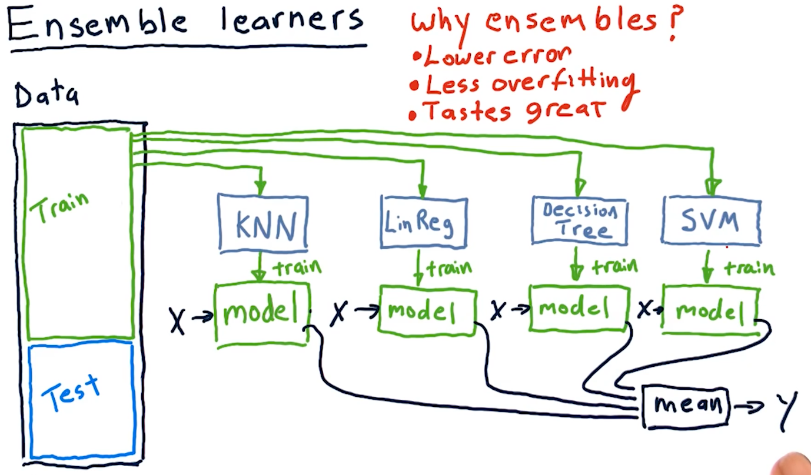
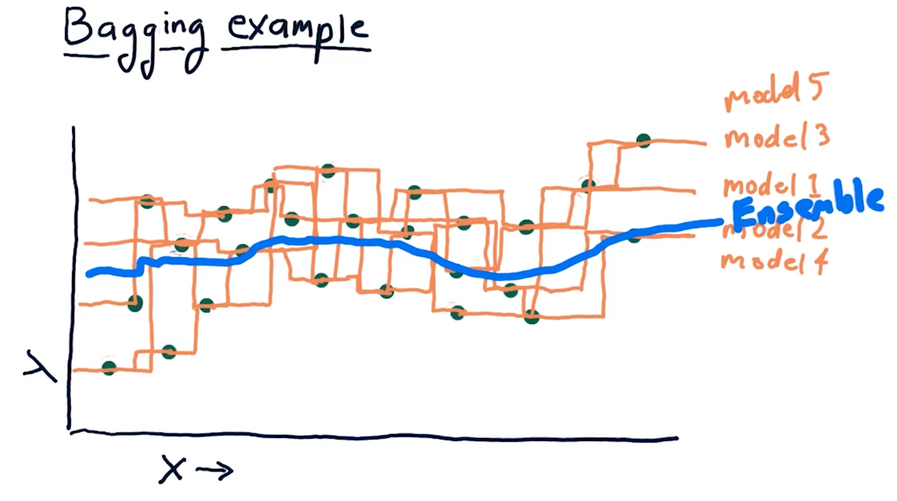
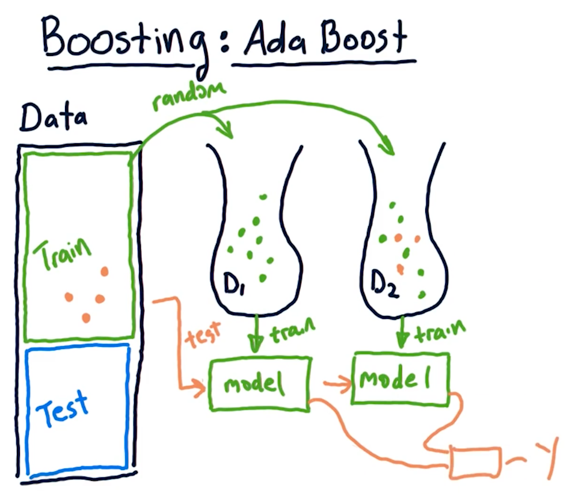

# 3-4: Ensemble learners - bagging and boosting

## Ensemble learners

Creating an **ensemble** of learners essentially means that we leverage multiple
different machine learning algorithms to produce a series of different models.
For **regression-based** learning, we provide each produced model an `x` and
take the mean of their `y` responses. Why use ensembles? Ensembles provide:

* Lower error
* Less overfitting
* Removal of algorithmic bias

A diagram representing this concept is provided below:

## Bootstrap aggregating-bagging

**Bagging** is a method of creating an **ensemble** of learners, however, we
utilize the same learning algorithm to create `m` number of bags and models.
What is a **bag**? A **bag** is a set of data derived from the original training
data for a learning algorithm, with up to `n'` items. `n'` will always be some
subset of `n` - usually 60%. The `n'` items selected from the original data are
**random with replacement** - we can have duplicate items selected from the
original data.

After we create our `m` bags with `n'` number of items, we use these bags to
train our models with the same learning algorithm. Like our ensemble before, we
take the `mean` of the models' predictions to generate our `y`.

## Bagging example

The example diagram provided below demonstrates how an **ensemble** of
1NN-generated models, using a different subset of random data for each model,
generates a much more smooth predictive line than a single 1NN-generated model.
Recall that 1NN-generated models **overfit** the data, however, if we combine
these **overfit** models into an **ensemble**, the **mean** prediction
provides better correlation with the data.

## Boosting: adaptive boost

**Boosting** is a technique similar to **bagging**, however, it aims to provide
weight to particular sections of data in the training data set that may be
poorly predicted. **Boosting** conducts the following actions:

* Select random values from `n` to generate a bag `m` of `n'` values
* Train a model and test the model against the original data within `n`
* Identify `x, y` predictions from this model that performed poorly
* Generate new model with `n'` values that are weighted toward `n` values with
poor predictions
* Train a model with the weighted data and generate more `x, y` predictions
* Calculate the mean of `y` with the old and new models
* Iterate over this procedure `m` times

