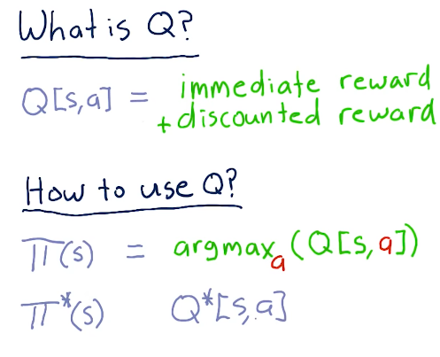
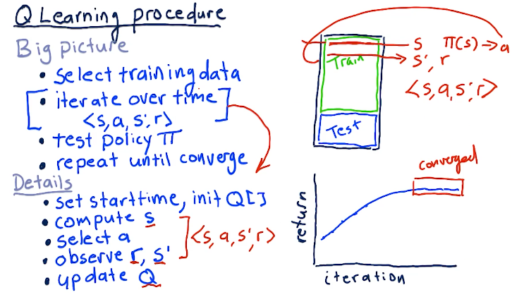
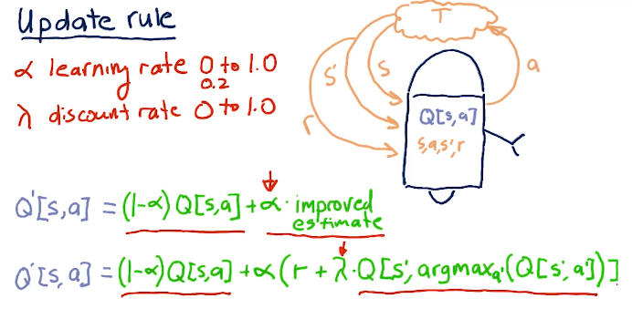
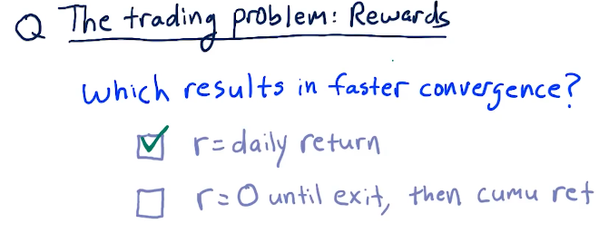
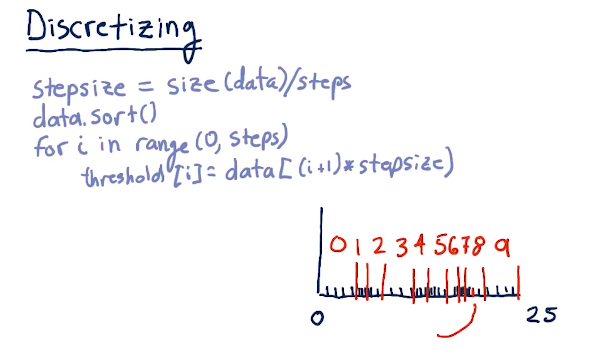

# 3-6: Q-learning

Q-learning is a **model-less** approach. It does not care about or use models of
**transition functions** like **T** or **rewards functions** like **R**.
Q-learning builds a table of utility values, or Q-values, at each step to select
the best action based on what it has learned so far. The best thing about
Q-learning is it is **guaranteed to provide an optimal policy**.

## What is Q?

**Q** is similar to the other functions like **T** and **R**, however, it
represents the **immediate reward** and **discounted reward** for an action
taken in a specific state. **Q** is not greedy, and considers the discounted
reward - so what happens today and tomorrow.

We use **Q** to generate a policy, **pi**, by finding the maximized argument
value for **action** to maximize the **Q** value. Eventually, we'll have an
optimal policy.

## Q-learning procedure

A series of things occurs when training our Q-learning model and generating our
Q table:

* First, we select our training data
* We iterate over this time-series data
  * We set a start time and initialize our Q table
  * We compute the starting state **S** given the inputs
  * We select our action **A**
  * We observe our end state **S'** and our reward
  * We update **Q** based on the outcomes
* Once we've generated our Q table, we test the policy, **pi** against testing
data
* Finally, we repeat until convergence, resulting in no further improvements

A high-level overview of these concepts is provided below:

## Update rule

One of the most important parts of Q-learning is the update rule. We can break
it down into simpler terms wherein our new Q table, **Q prime**, is equal to
our old Q table times 1 minus **alpha**, the learning rate, plus **alpha**
times our **reward** plus **gamma** times the Q table value derived from
**alpha prime** of our next decision to reach **S prime**. The writeup for the
update rule equation is provided in the lecture slide below:

## Two finer points

Q-learning is successful when we explore, and we can do that by taking random
actions. We can choose random actions with probability of **C**. So as we begin
to learn, we start out with **C**'s probability of us choosing a random action
to be pretty high. As we begin to learn more, our actions become less random.

## Actions

For our stock trading Q-learner, the following are some actions that can be
taken to transition to different states:

* **Buy**
* **Sell**
* **Nothing**

Below is an example from the lectures:

## Rewards

**Daily returns** for a reward signal to the Q-learner allows the learner to
converge must faster than a cumulative return.

## State

Below are some good factors for **state** to be used during Q-learning:

## Creating the state

In order for us to create the state, we have to translate all of our factors
into **discrete integers**. Some algorithm will conduct this, and then we'll
finally combine our factors into one number. Below is a lecture from the slides:

### Discretizing

Below is a quick breakdown from the lecture on how to discretize our data:

